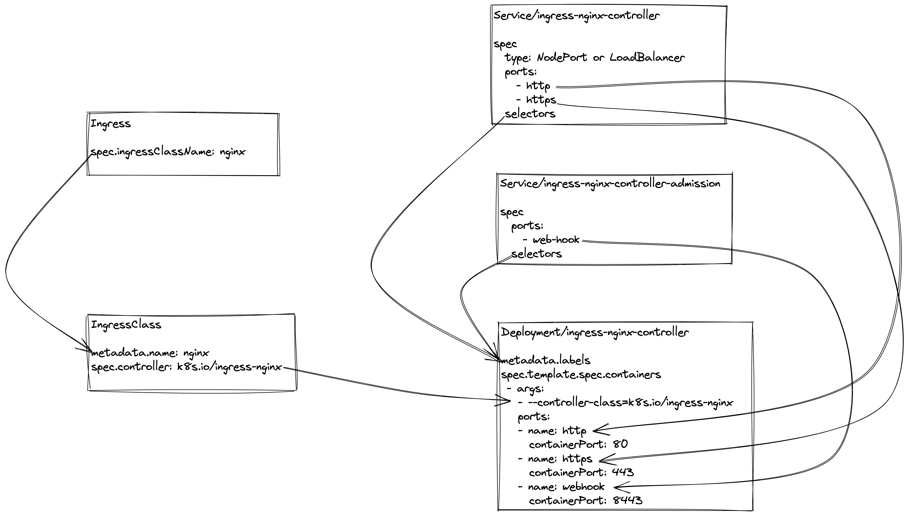

# Ingress

总共有如下几个object
- `Ingress`
  - 控制host的匹配，比如只允许发送给`example.com`的请求
  - 管理HTTP path的匹配，比如把哪些`/path-1`的请求转到`my-service-1`去，把`/path-2`的请求转到`my-service-2`去
  - 管理CORS
  - 管理TLS
  - 管理GRPC
- `IngressClass`
  - 代表到底我们用的是那一种ingress，是Nginx吗，还是其他类型的
- `Service/ingress-nginx-controller`
  - 这个Service要么是NodePort要么是LoadBalancer
  - 把请求端口暴露给client，前端就可以用`http://host:port`的形式访问
- `Service/ingress-nginx-controller-admission`
  - 控制webhook端口，给kubernetes-api-server自己用
- `Deployment/ingress-nginx-controller`
  - nginx pod
