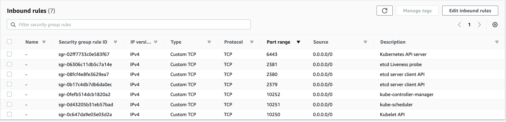
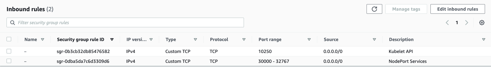

# Set up Kubernetes

This section describes how to set up a Kubernetes cluster by using `kubeadm`.

## Basic background.

- Docker不是一个单一的技术，而是一个tech stack。Docker本来就不是设计给K8S用的，所以在k8s v1.2开始就deprecate Docker了，但这并不意味着用Docker build出来的container用不了了，还是可以用。Docker的核心是`containerd`, 这个依然是K8S主流的container runtime。所谓的deprecated的地方是`dockerShim`, 这个是用来绕过Docker的UX的。你可以认为Docker是在`containerd`的外面包了一层UX给用户，但是K8S是不需要这层UX的，所以K8S最开始的时候用`dockerShim`来跟Docker的UX交互，但是这种架构冗余且容易出错。所以现在新的K8S是直接跟`containerd`交互，而不再支持Docker了。

## How to set up a K8S cluster.

- Prerequisite: Ports for Master and Worker Node

  You can find detailed info [here](https://kubernetes.io/docs/reference/ports-and-protocols/)





- Prerequisite: Forwarding IPv4 and letting iptables see bridged traffic

```shell
cat <<EOF | sudo tee /etc/modules-load.d/k8s.conf
overlay
br_netfilter
EOF

sudo modprobe overlay
sudo modprobe br_netfilter

# sysctl params required by setup, params persist across reboots
cat <<EOF | sudo tee /etc/sysctl.d/k8s.conf
net.bridge.bridge-nf-call-iptables  = 1
net.bridge.bridge-nf-call-ip6tables = 1
net.ipv4.ip_forward                 = 1
EOF

```

- Prerequisite for containered

```shell
sudo modprobe overlay
sudo modprobe br_netfilter

cat <<EOF | sudo tee /etc/modules-load.d/containerd.conf
overlay
br_netfilter
EOF

cat <<EOF | sudo tee /etc/sysctl.d/99-kubernetes-cri.conf
net.bridge.bridge-nf-call-iptables  = 1
net.ipv4.ip_forward                 = 1
net.bridge.bridge-nf-call-ip6tables = 1
EOF
```

- Prerequisite: Apply sysctl parameters without reboot to current running environment

```shell
sudo sysctl --system
```

- Install `containerd` packages

```shell
sudo apt-get update 
sudo apt-get install -y containerd
```

- Create a `containerd` configuration file

```shell
sudo mkdir -p /etc/containerd
sudo containerd config default | sudo tee /etc/containerd/config.toml
```

- Set the cgroup driver for `runc` to `systemd`
  
  At the end of this section in `/etc/containerd/config.toml`
  ```
        [plugins."io.containerd.grpc.v1.cri".containerd.runtimes.runc.options]
      ...
  ```

  Around line 112, change the value for `SystemCgroup` from `false` to `true`.
  ```
              SystemdCgroup = true
  ```

  If you like, you can use sed to swap it out in the file with out having to manually edit the file.
  ```
  sudo sed -i 's/            SystemdCgroup = false/            SystemdCgroup = true/' /etc/containerd/config.toml
  ```

- Restart containerd with the new configuration

```shell
sudo systemctl restart containerd
```

- On each server and worker node, [install kubernetes](https://kubernetes.io/docs/setup/production-environment/tools/kubeadm/install-kubeadm/#installing-kubeadm-kubelet-and-kubectl)

```shell
sudo apt-get update
sudo apt-get install -y apt-transport-https ca-certificates curl

sudo curl -fsSLo /usr/share/keyrings/kubernetes-archive-keyring.gpg https://packages.cloud.google.com/apt/doc/apt-key.gpg

echo "deb [signed-by=/usr/share/keyrings/kubernetes-archive-keyring.gpg] https://apt.kubernetes.io/ kubernetes-xenial main" | sudo tee /etc/apt/sources.list.d/kubernetes.list

sudo apt-get update
sudo apt-get install -y kubelet kubeadm kubectl
sudo apt-mark hold kubelet kubeadm kubectl
```

- For `kubeadm` to work properly, you need to disable swap on all the nodes

```shell
sudo swapoff -a
(crontab -l 2>/dev/null; echo "@reboot /sbin/swapoff -a") | crontab - || true
```

- Set variables for deployment and init your cluster
  
  Take care that your Pod network must not overlap with any of the host networks: you are likely to see problems if there is any overlap. (If you find a collision between your network plugin's preferred Pod network and some of your host networks, you should think of a suitable CIDR block to use instead, then use that during kubeadm init with --pod-network-cidr and as a replacement in your network plugin's YAML).

  For example, if you VPC CIDR is `10.0.0.0/16`, then a valid pot network cidr would be `10.244.0.0/16`.

  `10.244.0.0/16` is configured in the Flannel network plugin we will install later, and this is why we use it as an example here. You can change this value, but you also need to change the value in the Flannel config.

```shell
IPADDR="REPLACE_WITH_LOCAL_IP"
KUBELET_EXTRA_ARGS=--node-ip=$IPADDR
NODENAME=$(hostname -s)
POD_CIDR="10.244.0.0/16"

sudo kubeadm init --apiserver-advertise-address=$IPADDR  --apiserver-cert-extra-sans=$IPADDR  --pod-network-cidr=$POD_CIDR --node-name $NODENAME --ignore-preflight-errors Swap
```
  
  `--ignore-preflight-errors` Swap is actually not required as we disabled the swap initially.

  **(After this command finishes, copy kubeadm join provided)**

- On the Master server only, set up the kubernetes configuration file for general usage, you need to run the following as a regular user:
```shell
  mkdir -p $HOME/.kube
  sudo cp -i /etc/kubernetes/admin.conf $HOME/.kube/config
  sudo chown $(id -u):$(id -g) $HOME/.kube/config
```

- On the Master server only, apply a common networking plugin. In this case, Flannel
```
kubectl apply -f https://raw.githubusercontent.com/coreos/flannel/master/Documentation/kube-flannel.yml
```

- On the Worker servers only, join them to the cluster using the command you copied earlier. 
```
kubeadm join master_ip:6443 --token ... --discovery-token-ca-cert-hash ...
```
