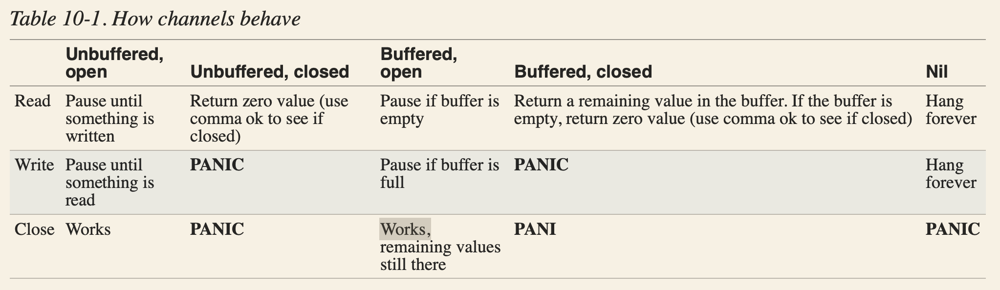

## Go commands

```
go mod init MODULE_PATH

go list -m -versions github.com/learning-go-book/simpletax

go get -u=patch

go mod tidy

go mod vendor
```





|   |   |   |   |   |
|---|---|---|---|---|
|   |   |   |   |   |
|   |   |   |   |   |
|   |   |   |   |   |
