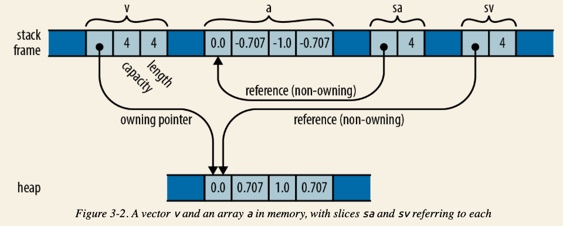
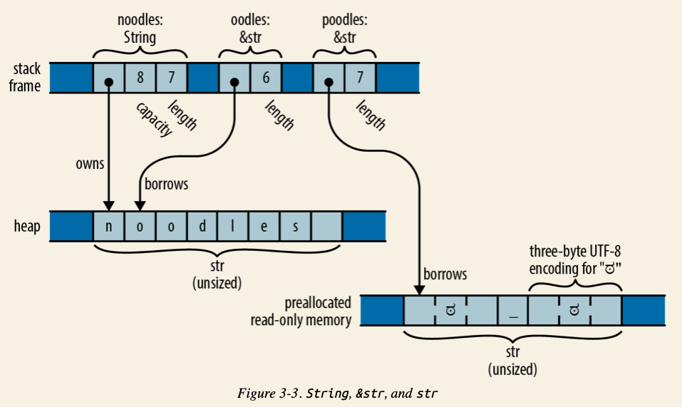

## Arrays, Slice and Vector
  ```rust
  let v: Vec<f64> = vec![0.0,  0.707,  1.0,  0.707];
  let a: [f64; 4] =     [0.0, -0.707, -1.0, -0.707];

  let sv: &[f64] = &v;
  let sa: &[f64] = &a;
  ```
  
- Arrays
  - Denoted as `[T, N]`, e.g., `let lazy_caterer: [u32; 6] = [1, 2, 4, 7, 11, 16]`
  - Fixed length, cannot be resized.
  - Value is stored on **stack**.????
  - When being passed as a function parameter, the value of the array is **copied**:
  ```rust
  fn main () {
      let a = [1, 2, 3];
      let b = f1(a);
      println!("{:?}", a);
      println!("{:?}", b);
  }

  fn f1(mut v: [u8; 3] ) -> [u8; 3] {
      v[1] = 8;
      v
  }
  ```
  Output is:
  ```
  [1, 2, 3]
  [1, 8, 3]
  ```
- Vector
  - Denoted as `Vec<T>`, e.g., `let mut primes: Vec<i32> = vec![2, 3, 5, 7];`
  - Resizable
  - Stored on heap.
  - A `Vec<T>` Consists of 3 values:
    - a pointer to the heap-allocated buffer, which is created and owned by the `Vec<T>`
    - the number of elements that the buffer has capacity to store
    - number of existing elements, a.k.a, length
  - When a `Vec<T>` being passed as a function parameter, the **reference** is actually passed:
  ```rust
  fn main () {
      let d = vec![1, 2, 3];
      println!("{:?}", f2(d));
  }

  fn f2(mut v: Vec<u8>) -> Vec<u8> {
      v.push(9);
      v
  }
  ```
  Output is:
  ```
  [1, 2, 3, 9]
  ```
- Slices
  - Denoted as `[T]`, it is a region of an array or a vector.
  - Since a slice can be any length, slices can’t be stored directly in variables or passed as function arguments. Slices are **always passed by reference**.
  - Slice reference is a *fat pointer*, a two-word value comprising the first element of the slice and the number of elements in the slice.
  - Both `[T; N]` and `Vec<T>` can be implicitly converted to `[T]`

### `String` and `&str`
```rust
let noodles: String = "noodles".to_string(); // On heap
let oodles: &str = &noodles[1..];
let poodles: &str = "ಠ_ಠ";
```



- `&str`
  - `&str` is a reference to a run of UTF-8 text owned by someone else: it “borrows” the text. The original text could be on heap or read-only memory
  - `"ಠ_ಠ"` is pre allocated read-only memory, neither on stack nor heap!
  - `&str`相当于`&[u8]`，并且这个字节slice一定是well-formed UTF-8:
  ```rust
  let poodles: &str = "ಠ_ಠ"; // 在这里poodles可以被认为是长度为7的字节slice
  assert_eq!("ಠ_ಠ".len(), 7);
  assert_eq!("ಠ_ಠ".chars().count(), 3);
  ```
  - It is impossible to modify a &str:
  ```rust
  let mut s = "hello";
  s[0] = 'c';    // error: `&str` cannot be modified, and other reasons
  ```

- `String`
  - `String`是一个struct, 并且这个struct拥有一个`Vec<u8>`的字段。同样，这个vector也是well-formed UTF-8.
