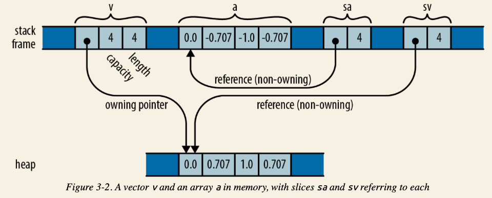
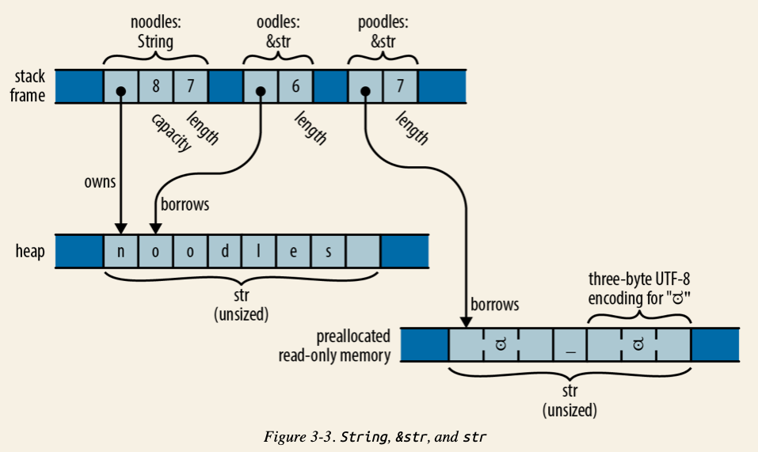

- Debug trait -> "{:?}"
- Clone trait -> 让数据结构可以被复制
- Copy trait
- Static variable

## Key Points
- For arithmetic operation overflows, rust panic in debug build, but wraps around in release build, it produces the value equivalent to the mathematically correct result modulo the range of the value
- checked_add/mul/, wrapping_add/mul
- *byte literals*: `b'A'` is equivalent to `65u8`
- `char`: 32bit long 
- The expression `&x` produces a reference to `x`; in Rust terminology, we say that it **borrows** a reference to x.

### Arrays, Slice and Vector
  ```rust
  let v: Vec<f64> = vec![0.0,  0.707,  1.0,  0.707];
  let a: [f64; 4] =     [0.0, -0.707, -1.0, -0.707];

  let sv: &[f64] = &v;
  let sa: &[f64] = &a;
  ```
  
- Arrays
  - Denoted as `[T, N]`, e.g., `let lazy_caterer: [u32; 6] = [1, 2, 4, 7, 11, 16]`
  - Fixed length, cannot be resized.
  - Value is stored on **stack**.????
  - When being passed as a function parameter, the value of the array is **copied**:
  ```rust
  fn main () {
      let a = [1, 2, 3];
      let b = f1(a);
      println!("{:?}", a);
      println!("{:?}", b);
  }

  fn f1(mut v: [u8; 3] ) -> [u8; 3] {
      v[1] = 8;
      v
  }
  ```
  Output is:
  ```
  [1, 2, 3]
  [1, 8, 3]
  ```
- Vector
  - Denoted as `Vec<T>`, e.g., `let mut primes: Vec<i32> = vec![2, 3, 5, 7];`
  - Resizable
  - Stored on heap.
  - A `Vec<T>` Consists of 3 values:
    - a pointer to the heap-allocated buffer, which is created and owned by the `Vec<T>`
    - the number of elements that the buffer has capacity to store
    - number of existing elements, a.k.a, length
  - When a `Vec<T>` being passed as a function parameter, the **reference** is actually passed:
  ```rust
  fn main () {
      let d = vec![1, 2, 3];
      println!("{:?}", f2(d));
  }

  fn f2(mut v: Vec<u8>) -> Vec<u8> {
      v.push(9);
      v
  }
  ```
  Output is:
  ```
  [1, 2, 3, 9]
  ```
- Slices
  - Denoted as `[T]`, it is a region of an array of a vector. 
  - Since a slice can be any length, slices can’t be stored directly in variables or passed as function arguments. Slices are **always passed by reference**. 
  - Slice reference is a *fat pointer*, a two-word value comprising the first element of the slice and the number of elements in the slice.
  - Both `[T; N]` and `Vec<T>` can be implicitly converted to `[T]`

### `String` and `&str`
```rust
let noodles: String = "noodles".to_string(); // On heap
let oodles: &str = &noodles[1..];
let poodles: &str = "ಠ_ಠ";
```



- `&str`
  - `&str` is a reference to a run of UTF-8 text owned by someone else: it “borrows” the text. The original text could be on heap or read-only memory
  - `"ಠ_ಠ"` is pre allocated read-only memory, neither on stack nor heap!
  - `&str`相当于`&[u8]`，并且这个字节slice一定是well-formed UTF-8:
  ```rust
  let poodles: &str = "ಠ_ಠ"; // 在这里poodles可以被认为是长度为7的字节slice
  assert_eq!("ಠ_ಠ".len(), 7);
  assert_eq!("ಠ_ಠ".chars().count(), 3);
  ```
  - It is impossible to modify a &str:
  ```rust
  let mut s = "hello";
  s[0] = 'c';    // error: `&str` cannot be modified, and other reasons
  ```

- `String`
  - `String`是一个struct, 并且这个struct拥有一个`Vec<u8>`的字段。同样，这个vector也是well-formed UTF-8.


### Ownership, Move

- 把一个指针赋值给另一个变量，实际上是让渡了所有权
```rust
let data: Vec<u32> = vec![1, 2, 3, 4];
let data1: Vec<u32> = data; // 创建一个新的指针data1，并且让它指向data所指向的内存。
```
  在这个例子中，`data`是一个指针，指向堆上的vector. 当`data`被赋给`data1`后，所有权也进行了让渡，此时再访问`data`就会出错。

- 调用`our_print`函数会让渡所有权，因为它要求的入参是Vec<T>
```rust
fn our_print<T>(Vec<T>) {
    println!()
}
``` 

- `println!()`, `format!()` 不会让渡所有权，因为其内部实现实际上是借了一个引用过去


### Reference, Borrow

- The `&` mark "borrows" a reference pointing to a piece of data. It actually create a new pointer pointing to the data.

#### Reference, Borrow原则
- 情况一：在同一时间内，一个数据可以有**多个只读的引用**，引用的作用范围可以有交叉
- 情况二：在同一作用域内，如果有可变的引用，那么首先不能有其他**只读**的引用了，并且多个可变引用的**活跃时间不能有交叉**。

##### Example 1
- 编译错误, error[E0502]: cannot borrow `data` as immutable because it is also borrowed as mutable
- 因为在第一次可变引用的作用范围内，你不能再借第二次
```rust
fn main() {
    let mut data: Vec<u32> = vec![1, 2, 3, 4];
    let data1: &mut Vec<u32> = &mut data; // 第一个引用，可变
    
    data1.push(5); // 第一个引用，可变
    println!("{:?}", data); // 第二个引用，不可变
    
    data1.push(6); // 第一个引用，可变
}
```

##### Example 2
- 编译错误, cannot borrow `data` as mutable more than once at a time
- 因为第一次和第二次有交叉
```rust
fn main() {
    let mut data: Vec<u32> = vec![1, 2, 3, 4];
    let data1: &mut Vec<u32> = &mut data; // 第一个引用，可变
    
    data1.push(5); // 第一个引用，可变
    println!("{:?}", data1); // 第一个引用，可变
    
    data.push(6); // 第二个引用，可变
    println!("{:?}", data1);  // 第一个引用，可变
}
```

##### Example 3
- 无编译错误
- 第一次输出`[1, 2, 3, 4, 5]`
- 第二次输出`[1, 2, 3, 4, 5, 6]`
```rust
    let mut data: Vec<u32> = vec![1, 2, 3, 4];
    let data1: &mut Vec<u32> = &mut data; // 第一个引用，可变
    
    data1.push(5); // 第一个引用，可变
    println!("{:?}", data1); // 第一个引用，可变
    
    data.push(6); // 第二个引用，可变
    println!("{:?}", data);  // 第二个引用，可变
```

##### Example 4
- 无编译错误
- 一次输出`[1, 2, 3, 4, 5]`
- 第二次输出`[1, 2, 3, 4, 5, 6]`
- 第三次输出`[1, 2, 3, 4, 5, 6， 7]`
```rust
    let mut data: Vec<u32> = vec![1, 2, 3, 4];
    let data1: &mut Vec<u32> = &mut data; // 第一个引用，可变

    data1.push(5); // 第一个引用，可变
    println!("{:?}", data1); // 第一个引用，可变

    data.push(6); // 第二个引用，可变
    println!("{:?}", data); // 第二个引用，可变

    data.push(7); // 第二个引用，可变
    println!("{:?}", data); // 第二个引用，可变
```

##### Example 5
- 编译错误，error[E0499]: cannot borrow `data` as mutable more than once at a time
- 第一次第二次有交叉
```rust
    let mut data: Vec<u32> = vec![1, 2, 3, 4];
    let data1: &mut Vec<u32> = &mut data; // 第一个引用，可变

    data1.push(5); // 第一个引用，可变
    println!("{:?}", data1); // 第一个引用，可变

    data.push(6); // 第二个引用，可变
    println!("{:?}", data); // 第二个引用，可变

    data1.push(7); // 第一个引用，可变
```

### Rc (Reference counter), RefCell


### Arc (Atomic reference counter)

### Atomic Types
[Official Document](https://doc.rust-lang.org/std/sync/atomic/index.html)

### Lifetime

Principles:
- 所有引用类型的参数都有独立的生命周期 'a 、'b 等。
- 如果只有一个引用型输入，它的生命周期会赋给所有输出。
- 如果有多个引用类型的参数，其中一个是 self，那么它的生命周期会赋给所有输出。

#### Example 1
```rust
// 该函数将会按delimiter将输入的字符串分开，返回前面一段的同时，让原指针指向后面的一段。
pub fn strtok<'a, 'b>(s: &'b mut &'a str, delimiter: char) -> &'a str {
    if let Some(i) = s.find(delimiter) {
        let prefix = &s[..i];
        // 由于 delimiter 可以是 utf8，所以我们需要获得其 utf8 长度，
        // 直接使用 len 返回的是字节长度，会有问题
        let suffix = &s[(i + delimiter.len_utf8())..];
        *s = suffix;
        prefix
    } else {
        // 如果没找到，返回整个字符串，把原字符串指针 s 指向空串
        let prefix = *s;
        *s = "";
        prefix
    }
}

// 生命周期只标注在了&str上， 这种标注的效果和上面的strtok一样
pub fn strtok2<'a>(s: &mut &'a str, delimiter: char) -> &'a str {
    if let Some(i) = s.find(delimiter) {
        let prefix = &s[..i];
        // 由于 delimiter 可以是 utf8，所以我们需要获得其 utf8 长度，
        // 直接使用 len 返回的是字节长度，会有问题
        let suffix = &s[(i + delimiter.len_utf8())..];
        *s = suffix;
        prefix
    } else {
        // 如果没找到，返回整个字符串，把原字符串指针 s 指向空串
        let prefix = *s;
        *s = "";
        prefix
    }
}

pub fn strtok3<'a>(s: &'a mut &str, delimiter: char) -> &'a str {
    if let Some(i) = s.find(delimiter) {
        let prefix = &s[..i];
        // 由于 delimiter 可以是 utf8，所以我们需要获得其 utf8 长度，
        // 直接使用 len 返回的是字节长度，会有问题
        let suffix = &s[(i + delimiter.len_utf8())..];
        *s = suffix;
        prefix
    } else {
        // 如果没找到，返回整个字符串，把原字符串指针 s 指向空串
        let prefix = *s;
        *s = "";
        prefix
    }
}

#[cfg(test)]
mod tests {
    use super::*;
    #[test]
    fn test_strtok() {
        let s = "hello world".to_owned();
        let mut s1 = s.as_str();
        let hello = strtok(&mut s1, ' ');
        println!("hello is: {}, s1: {}, s: {}", hello, s1, s);
        assert_eq!(hello, "hello");
        assert_eq!(s1, "world");
        assert_eq!(s, "hello world");
    }

    #[test]
    fn test_strtok2() {
        let s = "hello world".to_owned();
        let mut s1 = s.as_str();
        let hello = strtok2(&mut s1, ' ');
        println!("hello is: {}, s1: {}, s: {}", hello, s1, s);
        assert_eq!(hello, "hello");
        assert_eq!(s1, "world");
        assert_eq!(s, "hello world");
    }

    // 该test有编译错误 
    #[test]
    fn test_strtok_3_1() {
        let s = "hello world".to_owned();
        let mut s1 = s.as_str();
        let hello = strtok3(&mut s1, ' '); //对s1的第一次引用，可变

        // 因为在strok3中，入参和返回值被标注成同一个lifetime，所以下面的hello仍然被认为是对s1的第一次可变引用
        println!("hello is: {}, s: {}", hello, s); //hello相当于是对s1的第一次引用，可变
        println!("s1: {}", s1,); //第二次引用，不可变
    }

    // 该test有编译错误
    #[test]
    fn test_strtok_3_2() {
        let s = "hello world".to_owned();
        let mut s1 = s.as_str();
        let hello = strtok3(&mut s1, ' '); //对s1的第一次引用，可变

        println!("s1: {}", s1,); //对s1的第二次引用，不可变
        println!("hello is: {}, s: {}", hello, s); //hello相当于是对s1的第一次引用，可变
    }

    // 该test有编译错误
    #[test]
    fn test_strtok_3_3() {
        let s = "hello world".to_owned();
        let mut s1 = s.as_str();
        let hello = strtok3(&mut s1, ' '); //对s1的第一次引用，可变

        println!("hello is: {}, s1: {}, s: {}", hello, s1, s); //hello等于第一次引用，可变；s1等于第二次引用，不可变
    }
}
```

#### Example 2
```rust
// 错误，因为name指向的字符串会在函数结束时被drop掉
fn lifetime1() -> &str {
    let name = "Tyr".to_string();
    &name[1..]
}

// 错误，因为入参是一个有所有权的String，
// 那么在调用这个函数后String的所有权就被让渡给这个函数了
// 所以当这个函数结束后，这个String也会被drop掉 
fn lifetime2(name: String) -> &str {
    &name[1..]
}

// 正确，因为Char的源代码是Chars<'a>
fn lifetime3(name: &str) -> Chars {
    name.chars()
}
```

## Closure

- `move`关键字是指当closure捕获一个参数的时候，到底是捕获对它的引用还是捕获所有权
- 如果move了被捕获参数的所有权，那么闭包就不能call两次，比如下面的例子
```rust
let name = String::from("Tyr"); 

// 这个闭包会 clone 内部的数据返回，所以它不是 FnOnce 
let c = move |greeting: String| (greeting, name); 

println!("c call once: {:?}", c("qiao".into())); 

// 这次调用会报错
println!("c call twice: {:?}", c("bonjour".into()));
```

- 但是如果我们捕获的不是参数本身，而只捕获它的一个clone，那就可以call多次

```rust
let name = String::from("Tyr"); 

// 这个闭包会 clone 内部的数据返回，所以它不是 FnOnce 
let c = move |greeting: String| (greeting, name.clone()); 

// 所以 c 可以被调用多次 
println!("c call once: {:?}", c("qiao".into())); 
println!("c call twice: {:?}", c("bonjour".into()));
```

- Function that accepts a closure
```rust
fn map<B, F>(self, f: F) -> Map<Self, F>
where
    Self: Sized,
    F: FnMut(Self::Item) -> B,
{
    Map::new(self, f)
}
```

- Function that returns a closure
```rust
use std::ops::Mul;

fn main() {
    let c1 = curry(5);
    println!("5 multiply 2 is: {}", c1(2));

    let adder2 = curry(3.14);
    println!("pi multiply 4^2 is: {}", adder2(4. * 4.));
}

fn curry<T>(x: T) -> impl Fn(T) -> T
where
    T: Mul<Output = T> + Copy,
{
    move |y| x * y
}
```


## Questions:
- why sometimes we have to do `self.0 = img`, but sometimes we don't
- Difference between `Vec<T>` and `&Vec<T>`, when should use which?
  - When the function parameter is type `Vec<T>`, then ownership of the vector will move after you pass it to this function.
  - When the function parameter is type `Vec<T>` (immutable reference), then ownership remains to the vector after you pass its reference to this function.
