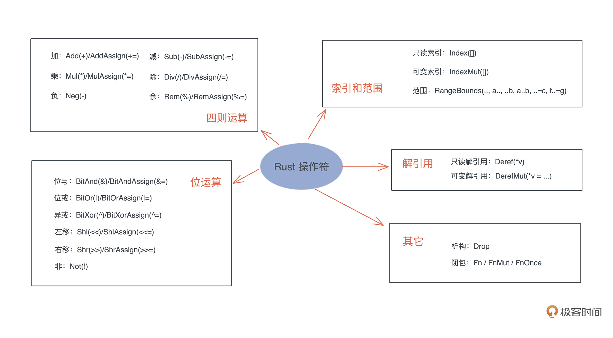

# Trait

- 当trait的定义里面使用了大写的`Self`后，需要加上`Self: Sized`来约束，比如
```rust
pub trait Parse {
    type Error;
    fn parse_dfs(s: &str) -> Result<Option<Self>, Self::Error>
    where
        Self: Sized;
}
```

- 为泛型实现trait，相当于是为不同的类型实现同一个trait。比如我们上面的Parse trait，我们可以为不同的数据结构实现这个trait，让他们都可以从string中转换而来。
- 实现泛型trait，相当于是为同一个类型实现一系列类似的trait。比如我们可以为ComplexNumber这个struct实现Add<Rhs> trait，让一个复数可以直接和其他复数，f64，i32等其他数进行相加。
- 可以这么理解：
  - `a + b` 实际可以看成是 `a.add(b)`，即 `a` 实现了 `add` 方法，并且这个方法的参数是 `b`
  - 所以对泛型实现trait，就是对不同的类型实现 `add(b: B)` 方法，从而可以有 `c + b`, `d + b`
  - 而泛型trait是让 add 方法的输入参数除了可以是 `B` 以外，还可以是其他类型，从而我们可以有 `a + c`, `a + d`
  - 所以这两者一起用就可以让我们实现**任意类型x**加**任意类型y**的情况
  - 并且这个“加”也可以变成其他词，比如任意类型转换成任意其他类型 `From` / `Into` trait
- 将函数的参数定义为trait，可以大大提高函数的通用性，就像Java里面把Interface作为方法的参数一样
```rust

use std::net::{IpAddr, Ipv4Addr, Ipv6Addr};

fn print(v: impl Into<IpAddr>) {
    println!("{:?}", v.into());
}

fn main() {
    let v4: Ipv4Addr = "2.2.2.2".parse().unwrap();
    let v6: Ipv6Addr = "::1".parse().unwrap();
    
    // IPAddr 实现了 From<[u8; 4]，转换 IPv4 地址
    print([1, 1, 1, 1]);
    // IPAddr 实现了 From<[u16; 8]，转换 IPv6 地址
    print([0xfe80, 0, 0, 0, 0xaede, 0x48ff, 0xfe00, 0x1122]);
    // IPAddr 实现了 From<Ipv4Addr>
    print(v4);
    // IPAddr 实现了 From<Ipv6Addr>
    print(v6);
}
```


## Trait Object

- Trait Object的本质是用来做动态分发，用来对静态分发做补充
- `&dyn`用来表示Trait Object
- 下面的例子中的`fomatters`代表一个实现了`Formatter` trait的一组object
```rust
pub fn format(input: &mut String, formatters: Vec<&dyn Formatter>) {
    for formatter in formatters {
        formatter.format(input);
    }
}
```

- 能产生trait object的trait必须是对象安全的（object-safe），其必须满足
  - trait的函数不能返回Self，是因为 `trait object` 在产生时，原来的类型会被抹去，所以 `Self` `究竟是谁不知道。比如上面的Parse` trait，假设`TreeNode`, `GraphNode`都实现了这个trait，那么在传入`Vec<&dyn Parser>`时，我们根本不知道到底要parse成什么
  - trait的函数不能有泛型输入,这是因为 Rust 里带泛型的类型在编译时会做单态化，而 trait object 是运行时的产物，两者不能兼容。


## Common Trait

- `Clone`, `Copy`, `Drop` trait，约定了数据被深拷贝和浅拷贝的行为，以及如何释放内存
- `Sized` / `Send` / `Sync` / `Unpin` 标记trait
- `From` / `Into` / `TryFrom` / `TryInto` 值类型到值类型的转换
- `AsRef` / `AsMut` 引用类型到引用类型的转换
- `Deref` / `DerefMut` trait 操作符相关，让类型在不暴露其内部结构代码的同时，让内部结构的方法可以对外使用
- `Borrow` / `BorrowMut` 专门为了类型间做hash和比较时设计的
- `Read` / `Write` trait，约定了对 I/O 读写的行为
- `Iterator`，约定了迭代器的行为
- `Debug`，约定了数据如何被以 debug 的方式显示出来的行为
- `Default`，约定数据类型的缺省值如何产生的行为

### Clone

```rust
pub trait Clone {
  fn clone(&self) -> Self;

  fn clone_from(&mut self, source: &Self) {
    *self = source.clone()
  }
}
```

- 可以看出，`clone_from`有缺省实现，所以我们一般只用实现`clone`就好了，但是这两者的侧重点不一样
- `a = b.clone()` 会先分配出一片内存，然后把`b`的数据拷贝到这片内存里，然后让`a`指向这片内存，所以**一定会出现内存分配**
- `a.clone_from(b)` 是把`b`里的数据拷贝到`a`现在指向的内存，所以如果`a`已经指向一片内存，这样就**不需要重新分配内存**了
- `Clone` trait是深拷贝，栈和堆上的内存一起拷贝。

### Copy

```rust
pub trait Copy: Clone {}
```

- 从源代码可以看出，`Copy` trait没有实现，这样的 trait 虽然没有任何行为，但它可以用作 trait bound 来进行类型安全检查，所以我们管它叫**标记** trait。
- 并且如果一个type想要`Copy`就必须先实现`Clone`，但反之却不一定，比如`String`实现了`Clone`但是没有实现`Copy`
- 原子类型和只读引用&T都实现了`Copy` trait，只要实现了这个trait在传递参数或者赋值的时候就会copy一份，否则所有权会移动。
- 可变引用&mut T就没有实现`Copy` trait

### Drop

- 一般只需要在两种特殊情况实现Drop trait
  - 第一种是希望在数据结束生命周期的时候做一些事情，比如记日志。
  - 第二种是需要对资源回收的场景。比如释放网络，硬盘资源，或者如在MutexGuard<T>中实现了 Drop 来释放锁资源
  - `Copy`和`Drop`是互斥的，不能为一个类型同时实现两个trait，因为`Copy`是把内存按每一个bit来拷贝，可以认为`Copy`只应当存在于非常简单的数据类型上，而`Drop`这种是对于复杂的需要释放额外资源的类型而设计的。


### Sized

- 这是一个标记trait
- 编译器会自动的对泛型类型和泛型函数标记上`Sized`，比如下面两者是等价的
```rust
struct Data<T> {
    inner: T,
}

fn process_data<T>(data: Data<T>) {
    todo!();
}
```

等价于

```rust
struct Data<T: Sized> {
    inner: T,
}

fn process_data<T: Sized>(data: Data<T>) {
    todo!();
}
```
- 标记了`Sized`的泛型，在编译期时大小就是固定的，可以用来当参数传递，如果没有这个约束，`T` 是大小不固定的类型， `process_data` 函数会无法编译。
- `?Sized`可以用来绕过这个限定，比如Cow就用了这个trait
```rust
pub enum Cow<'a, B: ?Sized + 'a> where B: ToOwned,
{
    // 借用的数据
    Borrowed(&'a B),
    // 拥有的数据
    Owned(<B as ToOwned>::Owned),
}
```
- 这样 `B` 就可以是 `[T]` 或者 `str` 类型，大小都是不固定的。要注意 `Borrowed(&'a B)` 大小是**固定**的，因为它内部是对 `B` 的一个**引用**，而引用的大小是固定的。

### Send / Sync

- 如果一个类型 T 实现了 Send trait，意味着 T 可以安全地从一个线程移动到另一个线程，也就是说所有权可以在线程间移动。
- 如果一个类型 T 实现了 Sync trait，则意味着 &T 可以安全地在多个线程中共享。
- 一个类型 T 满足 Sync trait，当且仅当 &T 满足 Send trait。
- 把上面的话重新翻译一下：&T 可以安全地在多个线程中共享，当且仅当 &T 可以安全地从一个线程移动到另一个线程
- 如果一个类型 T: Send，那么 T 在某个线程中的独占访问是线程安全的；如果一个类型 T: Sync，那么 T 在线程间的只读共享是安全的。
- 对于我们自己定义的数据结构，如果其内部的所有域都实现了 Send / Sync，那么这个数据结构会被自动添加 Send / Sync
- 基本上原生数据结构都支持 Send / Sync，也就是说，绝大多数自定义的数据结构都是满足 Send / Sync 的
- 不支持 Send/ Sync 的有
  - 裸指针 *const T / *mut T。它们是不安全的，所以既不是 Send 也不是 Sync。
  - UnsafeCell 不支持 Sync。也就是说，任何使用了 Cell 或者 RefCell 的数据结构不支持 Sync。
  - 引用计数 Rc 不支持 Send 也不支持 Sync。所以 Rc 无法跨线程。


### From / Into

```rust
pub trait From<T> {
    fn from(T) -> Self;
}

pub trait Into<T> {
    fn into(self) -> T;
}

// 实现 From 会自动实现 Into
impl<T, U> Into<U> for T where U: From<T> {
    fn into(self) -> U {
        U::from(self)
    }
}
```
- From 是把任何类型转换成我，Into 是把我转换成任何类型
- From 可以根据上下文做类型推导，使用场景更多，比如在下面的代码中，如果我们不在第二行显示的标注String，那么是无法编译通过的
```rust
let s = String::from("Hello world!");
let s: String = "Hello world!".into();
```
- 而且因为实现了 From 会自动实现 Into，反之不会。所以需要的时候，**不要去实现 Into**，**只要实现 From 就好了**
- `TryFrom` / `TryInto` 和上面的两个用法类似，只是会返回`Result<T, Self::Error>`

### AsRef / AsMut

```rust
pub trait AsRef<T> where T: ?Sized {
    fn as_ref(&self) -> &T;
}

pub trait AsMut<T> where T: ?Sized {
    fn as_mut(&mut self) -> &mut T;
}
```

- AsRef 是把我的引用转换成任意类型的引用
- AsMut 是把我的可变引用转换成任意类型的可变引用

### Deref / DerefMut

- 这两个trait是Rust中众多操作符trait中的两个，他们分别重载了两个操作符
  - Deref 相当于 `*v`，只读解引用
  - DerefMut 相当于 `*v = ...`，可变解引用
- 下面的几个type conversion被定义为 **Deref Coercions**，因为他们实现了 Deref / DerefMut
  - Values of type `&String` auto-convert to type `&str` without a cast.
  - Values of type `&Vec<i32>` auto-convert to `&[i32]`.
  - Values of type `&Box<Chessboard>` auto-convert to `&Chessboard`.
  - The purpose of Deref coercion is to make smart pointer types, like `Box`, behave as much like the underlying value as possible. Using a `Box<Chessboard>` is mostly just like using a plain `Chessboard`, thanks to Deref.
- 当且仅当以下两个条件同时满足时 Deref Coercions 就会发生
  - 第一，一个函数的参数是某个类型的引用 `&T`，(注意必须是 `T` 的引用)，但是传入的参数却是其他类型的引用 `&U`
  - 第二，`U` 实现了 `Deref<Target=T>`

```rust
pub trait Deref {
    // 解引用出来的结果类型
    type Target: ?Sized;
    fn deref(&self) -> &Self::Target;
}

pub trait DerefMut: Deref {
    fn deref_mut(&mut self) -> &mut Self::Target;
}
```

- `Deref` 是把我的引用转换成我定义的任意类型的引用
- `DerefMut` 不仅包含 `Deref`，同时还添加了可变引用
- 这里不要把 `Deref` 和 `AsRef` 搞混了，他们有如下几点不同：
  - 虽然他们最终返回的都是某个类型的引用，但是使用时机是不一样的，比如下面的代码中，`*y`，实际上是 `*(y.deref_mut())`，也就是说 `Deref` 是在 `*` 操作符出现后自动调用的。
    ```rust
    let mut x = 42;
    let y = &mut x;
    // 解引用，内部调用 DerefMut（其实现就是 *self）
    *y += 1;
    ```
  - 第二，Deref 需要自己定义一个 Target，这个 Target 应该是自己所包含，拥有，或者refer to的一个类型，比如smart pointer里面都包含了一个类型，比如 String 包含 str， Vec<T> 包含 [T]

- 


### Borrow / BorrowMut

```rust
trait Borrow<Borrowed: ?Sized> {
    // 别看懵了，这里的 Borrowed 只是一个泛型，相当于 T
    fn borrow(&self) -> &Borrowed;
}
```

- Borrow / BorrowMut 和 AsRef / AsMut 很像，都是把自己的引用变成另外一个类型的引用 &T, 但是 Borrow / BorrowMut **更严格**。
- 只有当类型 T 和类型 U 的 hash 值相同，或者可以进行有意义的比较时，我们才能为 T 实现 Borrow<U> trait. 比如 String 实现了 AsRef<str> AsRef<u8> AsRef<Path>，但是它只实现了 Borrow<str>，因为只有String 和 str 的哈希值一样且能进行有意义的比较。
- 这两个 trait 对于像 HashMap, HashSet 这样的键值对数据结构非常有用。

### ToOwned

```rust
trait ToOwned {
    type Owned: Borrow<Self>;
    fn to_owned(&self) -> Self::Owned;
}
```

- ToOwned 是对 Clone 的补充，大多数你需要复制一个数据的时候用 Clone 就好了的，但是有些时候不行。比如 &str 无法 clone 出一个 String，因为 Clone 的方法签名里面不允许。Clone 只允许从 &T 复制出 T，所以你只能从 &str 复制出 str，但是 str 和 [i32] 一样，它们都是**大小不固定的**，甚至**不能**被函数返回。

### Cow, 这不是trait，而是smart pointer
- 首先 A 实现了 Borrow<B>， 也就是说 &A 可以被借用成 &B
- 然后我们才可以为 B 实现 ToOwned<Owned=A>，也就是说 &B 可以被复制出拥有所有权的 A
- 举个例子，我们先是可以把 &String 借用成 &str，然后我们才能把 &str 变成 owned 的 String
- 然后把这两者结合，我们就可以来实现Cow，比如 Cow<str>，注意这里 Cow 的不是 String

```rust
enum Cow<'a, B: ?Sized>
    where B: ToOwned
{
    Borrowed(&'a B),
    Owned(<B as ToOwned>::Owned),
}
```

- Cow的一个典型使用场景是一个函数要么返回一个静态字符串常量，或者一个动态计算的字符串。
  - 在下面的例子中 `"out of memory"` 的类型是 &str，into 之后的结果是 Cow::Borrowed
  - `format!` 的结果是 String, into 之后的结果是 Cow::Owned
```rust
    use std::borrow::Cow;
    use std::path::PathBuf;
    fn describe(error: &Error) -> Cow<'static, str> {
        match *error {
            Error::OutOfMemory => "out of memory".into(),
            Error::StackOverflow => "stack overflow".into(),
            Error::MachineOnFire => "machine on fire".into(),
            Error::Unfathomable => "machine bewildered".into(),
            Error::FileNotFound(ref path) => format!("file not found: {}", path.display()).into(),
        }
    }
```

- 想一下如果上面的函数不用 Cow 的话改怎么写？
