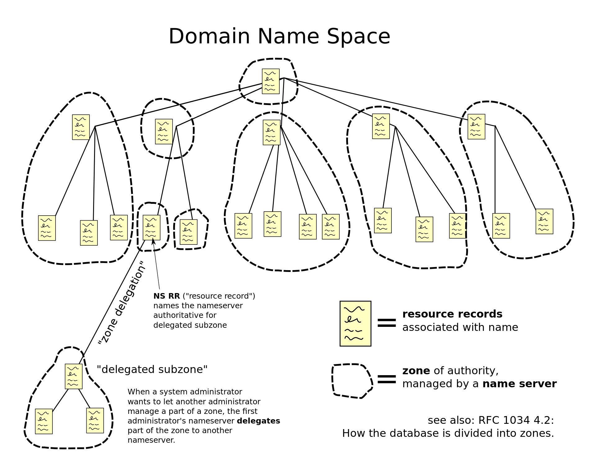
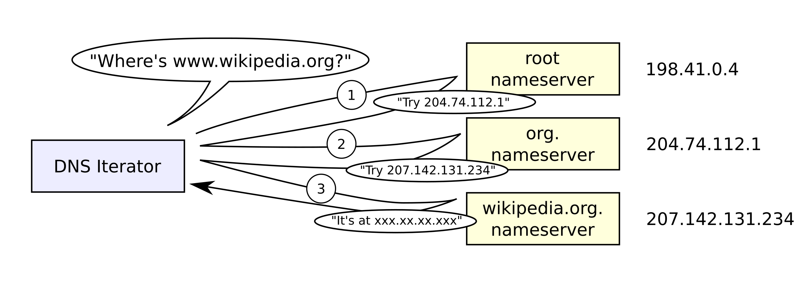
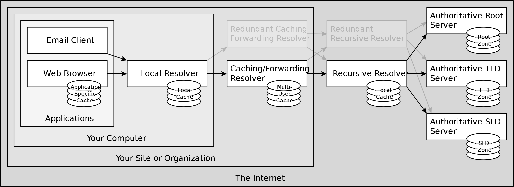

## Domain Name Service

### 结构
  - `www.example.com`是一个域名，其中`.com` 是 Top-level domain, 也称为`TLD`。其他TLD还有`.gov, .net`等
  - 在`.`两边的叫`label`或者`domain`，左边的`label`是右边`label`的subdomain, 比如`example`是`com`的subdomain，`www`是`example`的subdomain
  - 这个域名的完整形式是`www.example.com.`，也就是说在`com`的后面还有一个空的label，这个空的label是reserve给`root domain`的
  - 所以整个域名系统可以看成是从root domain开始的一棵树
  - Fully qualified domain是从树的叶子结点到根节点的一条路劲，比如下面是两个不同的FQDN
    - `en.wikipedia.org`
    - `zh.wikipedia.org`
  - 这棵树的一个节点，或者一颗子树可以称之为一个`zone`，如图所示
    

### 读取
  - DNS query的发起方称之为DNS resolver, 接收方为name server
  - Recursive读取，这种方式就是你问我，我不知道，但是我去帮你问别人，然后再告诉你。比如家的router和ISP就是这样，router里面的DNS resolver会去问ISP，但是ISP不知道的话会帮router去问其他name server
  - Iterative读取，这种方式就是你问我，我不知道，但是我给你说谁知道，然后你自己取问他。比如ISP的resolver需要解析`www.example.com`这个域名的话，他会首先去问`root domain`(root domain的IP地址是hardcoded)，此时`root domain`说不知道，不过你可以去问`.com`,他的地址是`123.123.123.0`。然后ISP就去问`.com`, 同样`.com`说我不知道，但是你可以去问`example.com`, 他的地址是`124.124.124.9`。以此类推，如下图所示
    
  - 在实践中，recursive和iterative读取是混在一起用的，如图所示，前面是recursive的，后面是iterative的
    
  - 操作系统会提供local resolver，主要做cache用。router中也会有DNS resolver，对应于图中`Your Site or Organization`的位置，ISP的resolver对应图中最后一个resolver

### Authoritative name server
  - 在整个系统中有两种name server，一种是他自己本来不知道任何数据，但是他从别人那听来了一些数据（也就是caching），或者他可以帮你去问别人要数据。这种就是上说的recursive或者iterative name server, `8.8.8.8`就是这种name server
  - 另外一种是自己本来就知道数据（这些数据通常都是少量的提前配置好的数据），不用去像别人打听，这种称为Authoritative name server（权威名称服务器）。比如`github.com`的一个Authoritative name server 是`@ns-421.awsdns-52.com`, 通过他你可以知道github的IP地址，如
  ```
  dig @ns-421.awsdns-52.com github.com

  ;; ANSWER SECTION:
  github.com.		60	IN	A	192.30.255.113             <-- A代表IP地址, 60代表TLL 60秒
  
  ;; AUTHORITY SECTION:    <-- AUTHORITY SECTION下面是更多其他Authoritative Name server
  github.com.		900	IN	NS	dns1.p08.nsone.net.        <-- NS 代表name server， 900秒 TTL
  github.com.		900	IN	NS	dns2.p08.nsone.net.
  github.com.		900	IN	NS	dns3.p08.nsone.net.
  github.com.		900	IN	NS	dns4.p08.nsone.net.
  github.com.		900	IN	NS	ns-1283.awsdns-32.org.
  github.com.		900	IN	NS	ns-1707.awsdns-21.co.uk.
  github.com.		900	IN	NS	ns-421.awsdns-52.com.
  github.com.		900	IN	NS	ns-520.awsdns-01.net.
  ```
