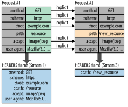

## HTTP 1.1 

### HTTP 1.1: Occupies an entire TCP connection


- Client and Server establish a TCP connection first.
- Client sends the request and then **wait**.
- Server returns the response.
- 

### HTTP 1.1: Browsers' work around


- Old browsers can maintain two TCP connections per domain, newer browsers can maintain 6 connections per domain
- This only postpone the problem, does not solve it.

## HTTP 2

### HTTP 2: Multiplexing


### HTTP 2: Server Push


### HTTP 2: Header Compression - HPACK


- Compressing the header can save the bandwidth because a lot of head key-value paris are duplicated across different requests.
- Previous compression method is vulnerable to CRIME attack, so the HTTP working group created a new specification called HPACK
- Compression and decompression happens to the entire TCP connection, which means streams in a single connection, shares the same compressor/decompressor instance.
- Static table: Defined in the protocol, index 1 to index 61, contains the most common header key-value paris that all connections are likely to use, for example
  ```
  +-------+-----------------------------+---------------+
  | Index | Header Name                 | Header Value  |
  +-------+-----------------------------+---------------+
  | 1     | :authority                  |               |
  | 2     | :method                     | GET           |
  | 3     | :method                     | POST          |
  | 4     | :path                       | /             |
  | 5     | :path                       | /index.html   |
  | 6     | :scheme                     | http          |
  | 7     | :scheme                     | https         |
  | 8     | :status                     | 200           |
  | 9     | :status                     | 204           |
  | 10    | :status                     | 206           |
  | 11    | :status                     | 304           |
  | 12    | :status                     | 400           |
  | 13    | :status                     | 404           |
  | 14    | :status                     | 500           |
  | 15    | accept-charset              |               |
  | 16    | accept-encoding             | gzip, deflate |
  | 17    | accept-language             |               |
  | 18    | accept-ranges               |               |
  | 19    | accept                      |               |
  | ...   |                             |               |
  | 61    | www-authenticate            |               |
  +-------+-----------------------------+---------------+
  ```
  A index number will appear in the HEADER frame to replace the actual key-value pari. For records that only have key but not value, the index number will only replace the key, and we still need to put the value in the frame.
- Dynamic table: Initially empty, and is updated by both client and server based on exchanged values within a particular connections.

### HTTP 2: Header Compression Example



- The only difference between Request 1 and Request 2 is the `:path` field
- So in the HEADER frame of Request 2 we shall not resend the headers that have been sent in Request 1
- For Request 1, the `:method: GET` and `:scheme: https` will also be replaced by number `2` and `7` respectively in the frame.

### HTTP 2: TLS / ALPN

- TLS is mandatory in HTTP, which means there is only `HTTPS` and no `HTTP`.
- Client and server finish protocol negotiation during TLS. 
- The negotiation process is done by a TLW extension called Application Layer Protocol Negotiation (ALPN)
- During the negotiation process, the client will tell the server that it supports HTTP2. Then the server will send the server side HTTP 2 settings to the client. The settings contains followings:
  ```
  +------------------------+------+---------------+
  | Name                   | Code | Initial Value |
  +------------------------+------+---------------+
  | HEADER_TABLE_SIZE      | 0x1  | 4096          |
  | ENABLE_PUSH            | 0x2  | 1             |
  | MAX_CONCURRENT_STREAMS | 0x3  | (infinite)    |
  | INITIAL_WINDOW_SIZE    | 0x4  | 65535         |
  | MAX_FRAME_SIZE         | 0x5  | 16384         |
  | MAX_HEADER_LIST_SIZE   | 0x6  | (infinite)    |
  +------------------------+------+---------------+
  ```
